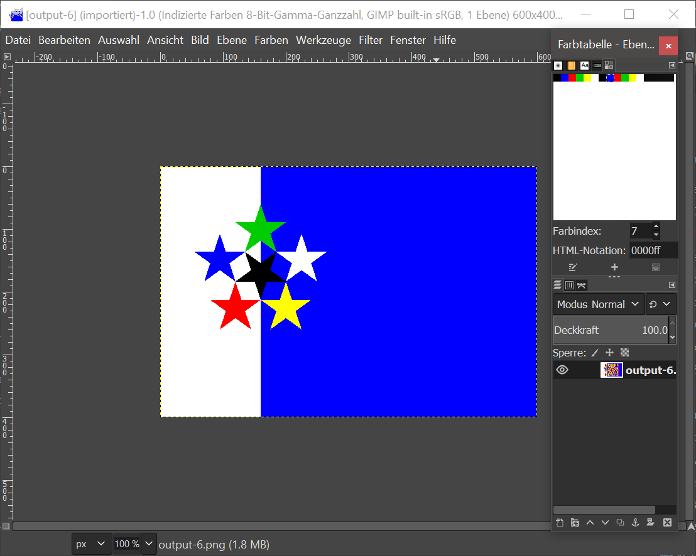
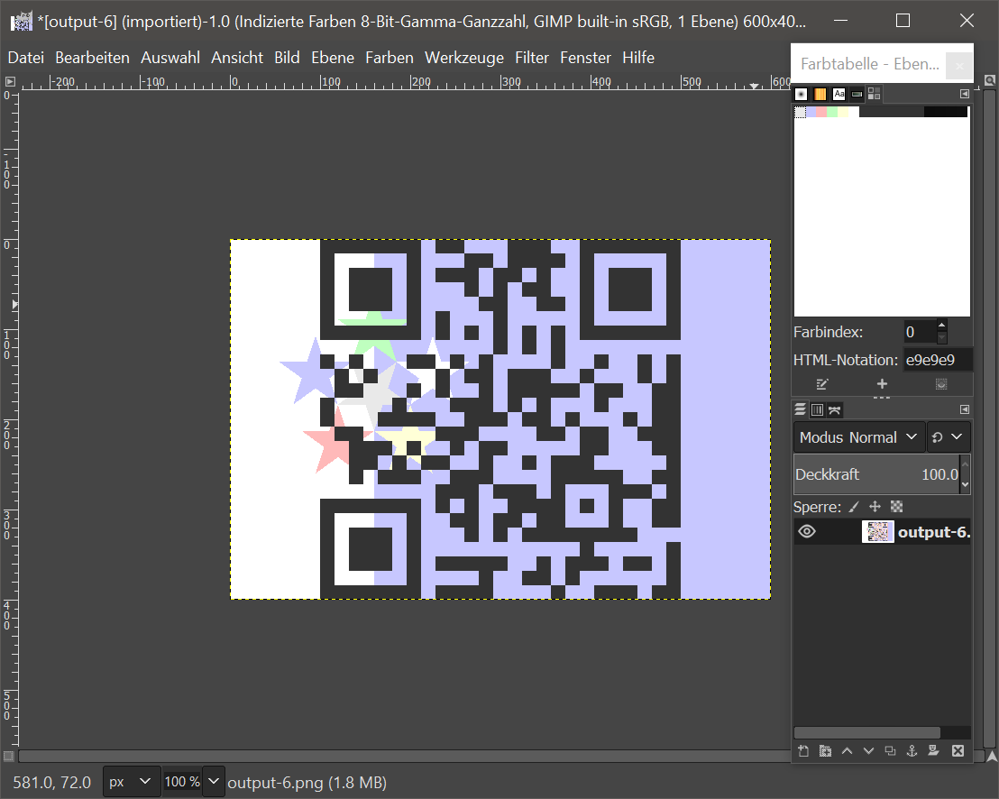
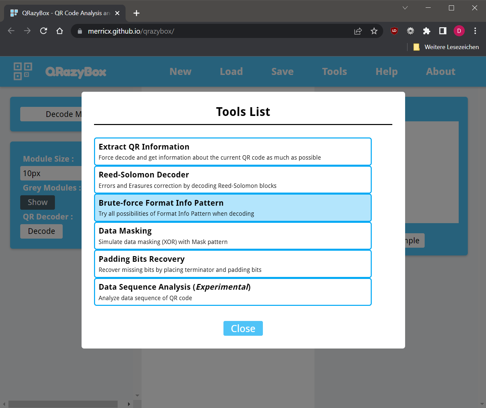
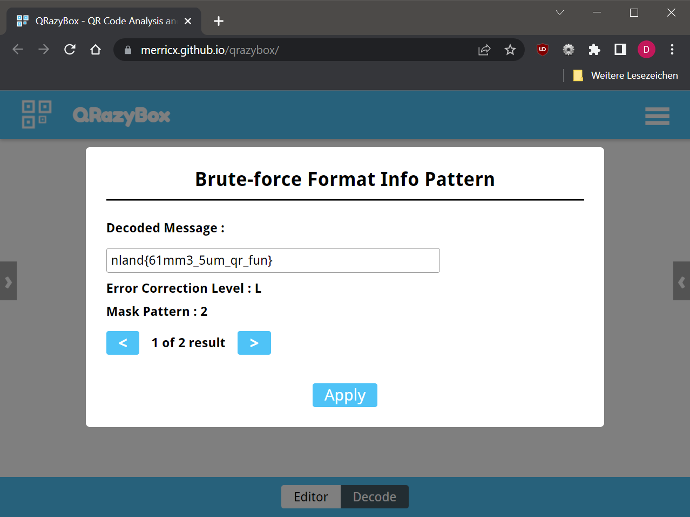

# Fun with Flags - Solution

For this challenge you received a challenge text and a PNG-file. The image 
obviously depictures a flag and some quick research tells us, that the flag 
shown is the Flag of the association for 'Flags of the World', thus the title.
We also learn that there are five hints to solve the challenge, with 'EXIF' 
beeing the zeroth one.

The first step is therefor to run our preferred EXIF dumping tool on the file:
```bash
 % exiftool output-6.png
ExifTool Version Number         : 12.16
File Name                       : output-6.png
Directory                       : .
File Size                       : 4.6 KiB
File Modification Date/Time     : 2021:11:22 20:46:43+01:00
File Access Date/Time           : 2022:04:08 19:14:54+02:00
File Inode Change Date/Time     : 2021:11:22 20:46:43+01:00
File Permissions                : rwxrwxrwx
File Type                       : PNG
File Type Extension             : png
MIME Type                       : image/png
Image Width                     : 600
Image Height                    : 400
Bit Depth                       : 4
Color Type                      : Palette
Compression                     : Deflate/Inflate
Filter                          : Adaptive
Interlace                       : Noninterlaced
Comment                         : We're no strangers to Exif.You know the rules 
and so do I.A full commitment's what I'm thinking of.You wouldn't get this 
(Hint 4) from any other guy..I just wanna tell you how I'm feeling. Gotta make 
you understand QR codes. Never gonna give you up. Never gonna let you down. 
Never gonna run around and desert you. Never gonna magic you cry. 
Never gonna say good bytes. Never gonna tell a lie and hurt you
Palette                         : (Binary data 48 bytes, use -b option to extract)
Warning                         : Unknown compression method 1 for hint
Hint                            : (Binary data 64 bytes, use -b option to extract)
Exif Byte Order                 : Little-endian (Intel, II)
User Comment                    : .............
Image Size                      : 600x400
Megapixels                      : 0.240
```

We found another hint and got rickrolled, very funny. The challenge has 
something to do with QR codes! That perfectly makes sense, since our buddy
Masahiro Hara is the inventor of QR codes.

Still, we need more information. This is a forensics challenge, after all.
Let's try our usual arsenal - file, strings, binwalk!

```bash
% file output-6.png
output-6.png: PNG image data, 600 x 400, 4-bit colormap, non-interlaced
% strings output-6.png
IHDR
tEXtComment
We're no strangers to Exif
You know the rules and so do I
[...]
QW1hemluZyBjaHVuayBhaGVhZCwgdHJ5IGhvbGRpbmcgd2l0aCBib3RoIGhhbmRzLiAoSGludCAzKQ==
0PLTE
[...]
Forget steghide. This is no stego challenge. (Hint 1)
[...]
?z|`
F*U.V*^>
+N,;n
IEND
No, seriously. This ain't no stego challenge! (Hint 2)
% binwalk output-6.png
DECIMAL       HEXADECIMAL     DESCRIPTION
--------------------------------------------------------------------------------
0             0x0             PNG image, 600 x 400, 4-bit colormap, non-interlaced
625           0x271           gzip compressed data, maximum compression, last modified: 2021-11-22 19:46:43
701           0x2BD           TIFF image data, little-endian offset of first image directory: 8
1817          0x719           Zlib compressed data, default compression
```

Great, we got another two hints! The author assures us that this is no stego 
challenge so we can happily skip stegseek/steghide & co. But we need more 
information! The output of `strings` looks weird - there is a quite long 
ASCII-string ending on "==". This looks familiar! Indeed, it is base64 encoded. 
Let's decode:
```bash
% echo QW1hemluZyBjaHVuayBhaGVhZCwgdHJ5IGhvbGRpbmcgd2l0aCBib3RoIGhhbmRzLiAoSGludCAzKQ== | base64 -d
Amazing chunk ahead, try holding with both hands. (Hint 3)
```

Amazing, we already have 4 out of 5 hints! The amazing chunk ahead could be a 
Titanite Chunk, but it's not. It's a PNG-chunk instead, so we have to dump the 
structure of the png file. We can use an online tool [^1] for that. We figure
that the chunk after the tEXt-chunk that gave us the hint is a PLTE and a zTXt 
chunk. Wikipedia tells us that zTXt is a compressed text chunk. We copy the 
chunk data into a file (`chunk.bin`) and inspect:
```bash
% xxd chunk.bin && file chunk.bin
00000000: 1f8b 0800 a3f3 9b61 02ff 0b29 cf4c 4e55  .......a...).LNU
00000010: 28c9 4855 c84d 2cce d651 48c9 2f4d ca81  (.HU.M,..QH./M..
00000020: 08a4 95e6 292a 182a 6416 2b18 e929 6878  ....)*.*d.+..)hx
00000030: 64e6 9528 986a 0200 9248 40f9 3000 0000  d..(.j...H@.0...
00000040: 0923 4224                                .#B$
chunk.bin: gzip compressed data, last modified: Mon Nov 22 19:46:43 2021, max compression, original size modulo 2^32 608314121
% gunzip < chunk.bin | xxd

gzip: stdin: decompression OK, trailing garbage ignored
00000000: 5477 6963 6520 7468 6520 6d61 736b 2c20  Twice the mask,
00000010: 646f 7562 6c65 2074 6865 2066 756e 2120  double the fun!
00000020: 3120 6973 2032 2e20 2848 696e 7420 3529  1 is 2. (Hint 5)
```

Phew! We now have collected all five hints. In summary:
- There is an amazing PLTE chunk (Hint 3)
- It aint no stego challenge (Hint 1 & 2)
- It has got something to do with QR codes (Hint 4)
- Something abouts masks. 1 is 2? (Hint 5)

Now comes to most tricky part. You need to recognize that the color palette of 
the image contains every color twice. Any capable graphic program (GIMP or 
Photoshop both work fine) can show you the color palette:


We fiddle around a bit with he colors and suddenly a wild QR code appears:


Almost there. The challenge has got one last trick up its sleeve. The QR code
doesn't scan yet. Also, we haven't used hint 5 yet. We need to learn more about
QR codes, so we head to our trusty Wikipedia. There we can learn, that QR codes
are not only used for vaccination certificates, but they also provide a mask
(stupid pun, indeed)[^2].

We can now either implement QR codes by ourselv (which is a lot of work honestly!),
or use a debugger tool such as the QRazyBox[^3]. We load up the image, open the 
tool drawer and select the Format Info Bruteforcing tool.


We hit the "Decode"-button and finally receive the well-earned flag. The 
specified mask (Code 1) turned out to actually be mask 2.


[^1]: https://www.nayuki.io/page/png-file-chunk-inspector
[^2]: https://en.wikipedia.org/wiki/QR_code
[^3]: https://merricx.github.io/qrazybox/
